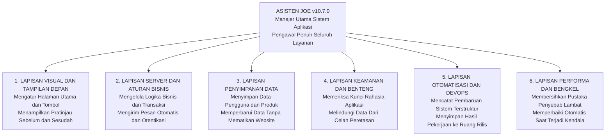
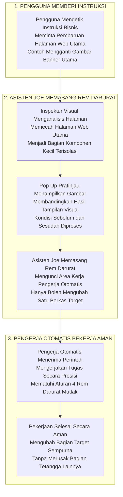
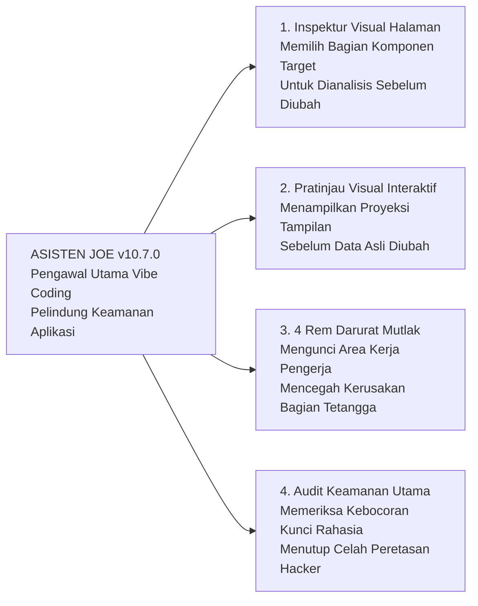
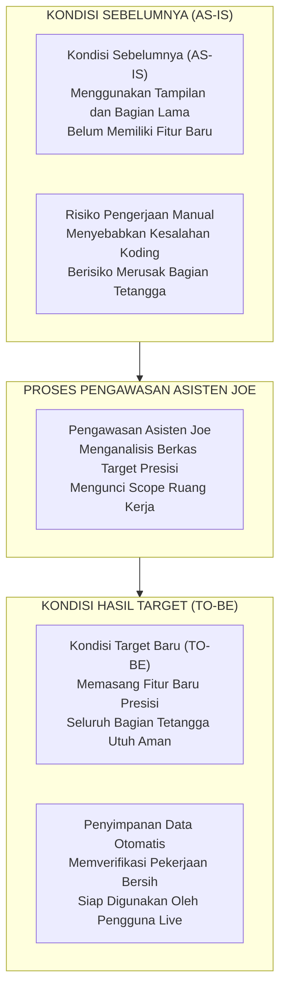
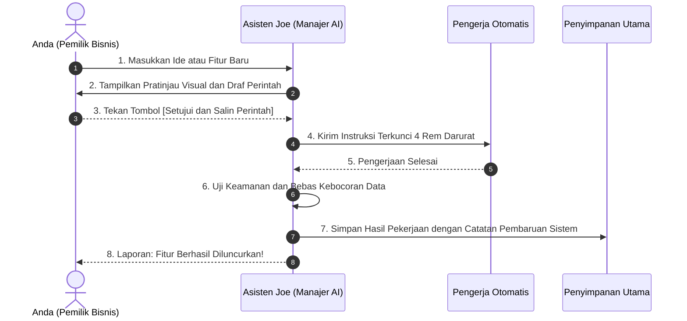
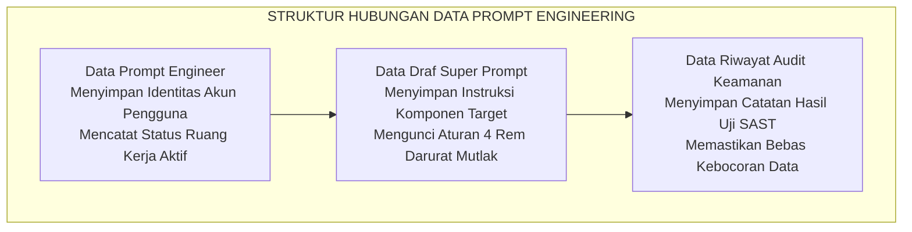
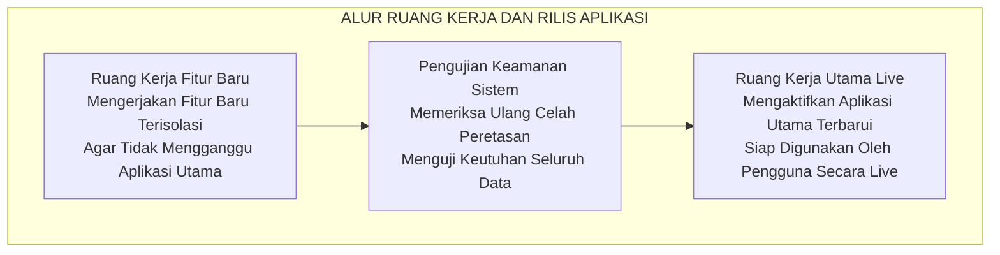

# PUSAT REPOSITORI SAAS & EKSTENSI ASISTEN JOE v10.7.0

Selamat datang di repositori resmi **SaaS Branching Blueprint** dan **Ekstensi Asisten Joe v10.7.0 (Object-Agnostic Emergency Brakes Suite)**. Dokumen ini disusun untuk memberikan panduan alur kerja digital dan pengoperasian ekstensi pengawal Vibe Coding di Antigravity IDE.

---

## ASISTEN JOE v10.7.0 -- OBJECT-AGNOSTIC EMERGENCY BRAKES SUITE

Ekstensi pendamping Vibe Coding & Dedicated Prompt Generator di Antigravity IDE / VS Code yang mengadopsi repositori open-source tingkat tinggi teruji dari GitHub (`skills.sh`, `OpenClaw`, `Promptfoo`, & `Stanford DSPy`):

1. **Object-Agnostic Emergency Brakes Engine (v10.7.0):** Sistem Rem Darurat Mutlak Generik Universal yang Berkelakuan Abstrak Tanpa Hardcode Objek Spesifik:
   - Target Scope Isolation Brake: Mengunci eksekusi secara absolut pada berkas target `${targetFile}` tanpa memicu Scope Creep.
   - Non-Target Embargo Brake: Melarang keras merubah, menghapus, atau merusak komponen, modul, fungsi, atau berkas tetangga di luar target.
   - Architectural & Design Standard Constraint Brake: Memaksa kepatuhan standar proyek (`BRAND.md` untuk UI, OpenAPI/REST untuk API, Normalisasi 3NF untuk DB, Standar CLI) tanpa menyuntikkan *ghost pattern*.
   - Minimal Mutation Threshold Brake: Membatasi perubahan `git diff` seminimal mungkin pada area kerja presisi.
2. **Visual Page Inspector & IDE Prompt Generator Engine (v10.6.0):** Alur kerja inspeksi visual halaman web (memecah halaman web menjadi komponen terisolasi).
3. **Interactive Before & After Design Preview Modal Engine (v10.5.0):** Menampilkan Pop-Up Modal simulasi pratinjau visual komparasi tampilan **SEBELUM (AS-IS)** vs **SESUDAH (TO-BE)** secara interaktif.
4. **RDBMS Architecture & Migration Guard Engine (v10.4.0):** Audit otomatis skema basis data relasional (Normalisasi 3NF, Indeks B-Tree FK, Zero-Downtime Migration, SAST SQL Injection Guard).
5. **AS-IS vs. TO-BE Architectural Transformation Engine (v10.3.0):** Generator perbandingan visual side-by-side kondisi arsitektur sistem saat ini (**AS-IS**) lawan kondisi arsitektur target setelah prompt dieksekusi (**TO-BE**).
6. **Multi-Diagram Project Visualizer Engine (v10.2.0):** Menghasilkan 5 diagram visual utuh untuk proyek Anda berstandar Mermaid.js.
7. **Human-Friendly Layperson Commit Engine (v10.1.0):** Mengubah pesan commit teknis yang rumit menjadi **Format Pesan Commit Ringkas & Terstruktur** yang Sangat Mudah Dibaca oleh Klien dan Product Manager.
8. **Semantic Versioning Automator Engine (v10.0.0):** Mengotomatiskan & mengoptimalkan penomoran skema Semantic Versioning (`v[Major].[Minor].[Patch]` / `x.x.0`).
9. **Anti-Layout Mutation & Asset Guard Engine (v9.9.0):** Memutus kebiasaan buruk Grafity yang sering merusak Navbar, layout CSS, atau halaman web lain saat diminta sekadar mengganti gambar/foto.

### Pemasangan Ekstensi (.vsix)

1. Buka **Extensions** di Antigravity IDE (`Cmd + Shift + X`).
2. Klik `...` di kanan atas -> Pilih **"Install from VSIX..."**.
3. Pilih berkas rilis resmi:  
   👉 **[saas-workflow-ide-plugin-10.7.0.vsix](file:///Users/user/Downloads/Prompt%20Engginer/plugin-ide/saas-workflow-ide-plugin-10.7.0.vsix)**

---

## VISUALISASI ARSITEKTUR SISTEM (7 DIAGRAM SISTEM)

Berikut adalah 7 Diagram Visual yang disajikan murni tanpa kode HTML, tanpa tag div, dan tanpa emoji:

### 1. DIAGRAM PETA 6 LAPISAN UTAMA SISTEM

### 2. DIAGRAM ALUR KERJA UTAMA

### 3. DIAGRAM PETA 4 PILAR PELINDUNG SISTEM (DIAGRAM LR - RATA KIRI)

### 4. DIAGRAM TRANSFORMASI ARSITEKTUR

### 5. DIAGRAM SIKLUS PERJALANAN FITUR BARU

### 6. DIAGRAM STRUKTUR RELASI DATA PROMPT ENGINEERING

### 7. DIAGRAM PETA ALUR RUANG KERJA DAN RILIS SISTEM

---

## Ruang Kerja Digital (Branching Structure)

Proyek ini menggunakan 6 ruang kerja terisolasi:
1. **`main` (Sistem Utama Aktif):** Live Output.
2. **`staging` (Ruang Simulasi Akhir):** Pre-release simulation.
3. **`close-packing` (Ruang Penutupan & Audit Akhir):** Code freeze.
4. **`develop` (Ruang Integrasi Tim):** Daily integration.
5. **`feature/*` (Ruang Kerja Fitur Baru):** Isolated feature branches.
6. **`hotfix/*` (Jalur Perbaikan Darurat):** Emergency hotfix.

---

## Lisensi & Perlindungan Hukum

Proyek ini dilindungi secara resmi oleh **[GNU Affero General Public License v3.0 (AGPL v3)](file:///Users/user/Downloads/Prompt%20Engginer/LICENSE)** (Copyright 2026 Joe Aryadharma / Joe Company Agent Lab).
